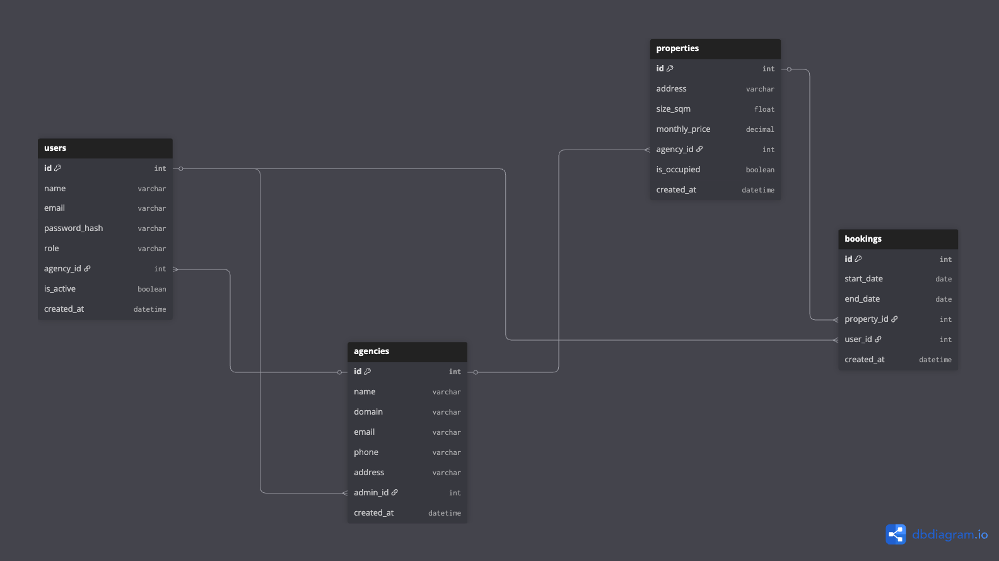

# SecureStay API
Eine sichere REST API für Immobilien-Agenturen, gebaut mit FastAPI und PostgreSQL.

## Was dieses Projekt zeigt

- REST API Architektur mit FastAPI
- JWT Authentication und Role-based Access Control
- Sichere Passwort-Speicherung mit bcrypt
- SQL Injection Prevention mit Prepared Statements
- Input Validation mit Pydantic
- Threat Model Dokumentation

## Technologien

- Python / FastAPI
- PostgreSQL
- JWT (python-jose)
- bcrypt
- Docker (geplant)

## Architektur



## Rollen

| Rolle | Beschreibung |
|---|---|
| Besucher | Kein Account |
| Kunde | Sucht und bucht Immobilien |
| Mitarbeiter | Verwaltet Immobilien |
| Admin | Voller Zugriff |

## Setup

```bash
git clone https://github.com/antibyotic/SecureStay.git
cd SecureStay
python3 -m venv venv
source venv/bin/activate
pip install -r requirements.txt
cp .env.example .env  # Fülle die Werte aus
uvicorn main:app --reload
```

## Dokumentation

- [Access Control](docs/access-control.md)
- [Threat Model](docs/threat-model.md)
